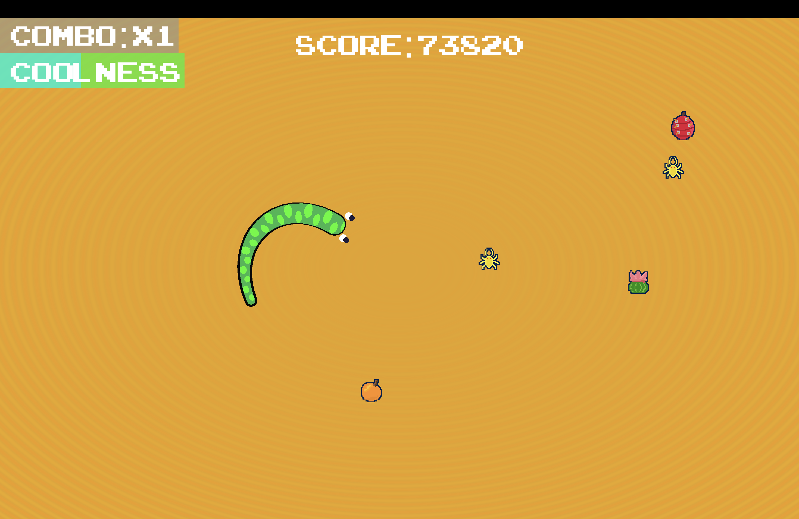

# Coil-Rush

Description:
 A game where you play as a snake stranded in the desert and have to eat to survive and grow longer every bite! The game is inspired by the desertic atmosphere of the Sahara Desert and uses procedural animation with shaders to deliver a vibe of being in an endless sand sea of strands.

---

Win Condition:
Collect Objects to earn points!

Eat fruits to increase coolness
If your coolness drops you'll dry out!

Pick up artifacts to increase your combo!
If you hit yourself your combo will reset

---

Credits: 
- All art and assets made by me! (This is my first time trying art!)
- All programming also done by me!
- Music and SFX from Uppbeat and Pixabay
